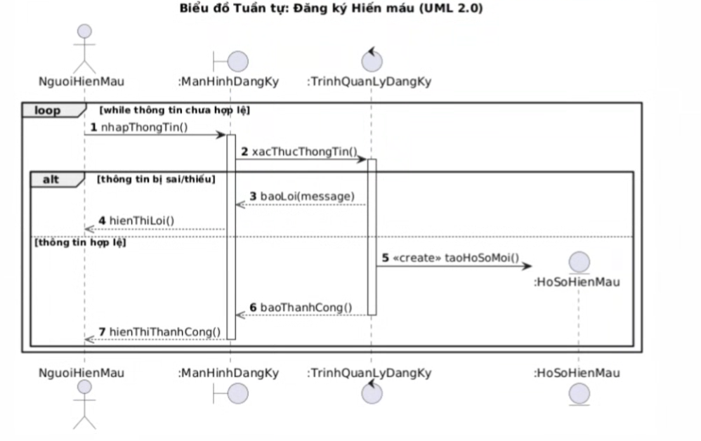
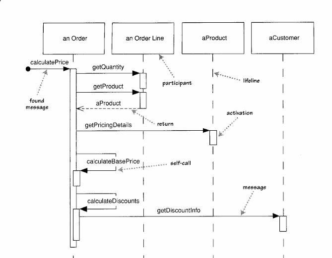

# Quy định thiết kế analysis sequence diagram

### 1. Sơ đồ tuần tự (Sequence Diagram) là gì?
Sơ đồ tuần tự là một loại sơ đồ tương tác, được dùng để mô tả quá trình hiện thực hóa một kịch bản (scenario) cụ thể của một ca sử dụng (use case). Sức mạnh lớn nhất của sơ đồ này là nó thể hiện luồng thông điệp (flow of messages) và thứ tự của chúng một cách rõ ràng.

Trong giai đoạn Phân tích (Analysis Workflow), sơ đồ này được sử dụng để thực hiện Hiện thực hóa Use Case (Use-Case Realization). Cụ thể, nó mô phỏng một kịch bản (scenario) duy nhất của một Use Case bằng cách chỉ ra các đối tượng tham gia và các thông điệp (messages) được truyền qua lại giữa chúng theo trình tự thời gian từ trên xuống dưới.

### 2. Các thành phần chính trong Sơ đồ tuần tự pha phân tích
**Các thành phần chính trên sơ đồ:**
*   **Người tham gia (Participants / Lifelines):** Đại diện cho các Actor và các đối tượng cụ thể (instances) của các lớp Boundary, Control, và Entity. Chúng được vẽ bằng các đường sinh mệnh (lifelines) chạy dọc xuống dưới.
*   **Thông điệp (Messages):** Các đường mũi tên ngang nối giữa các lifelines, thể hiện yêu cầu từ đối tượng này sang đối tượng khác.
*   **Thanh kích hoạt (Activation Bars):** Các hình chữ nhật hẹp trên lifeline, cho biết khoảng thời gian mà một đối tượng đang hoạt động (ví dụ: đang xử lý một tác vụ hoặc chờ phản hồi).
*   **Khung tương tác (Interaction Frames - UML 2.0):** Dùng để biểu diễn các cấu trúc điều khiển như vòng lặp (`loop`), rẽ nhánh (`alt`), hoặc tùy chọn (`opt`).

### 3. Các nguyên tắc và Lưu ý
Vì đây là sơ đồ ở mức **Phân tích (Analysis)**, phải tuân thủ:

**Quy tắc giao tiếp Boundary - Control - Entity (Dòng chảy messages):**
Các lớp không được gọi nhau lộn xộn. Messages flow phải tuân theo thứ tự:
1.  **Actor $\leftrightarrow$ Boundary:** Tác nhân bên ngoài chỉ được phép tương tác trực tiếp với giao diện (Boundary Class).
2.  **Boundary $\leftrightarrow$ Control:** Boundary Class nhận thao tác từ người dùng và gửi thông điệp chuyển tiếp yêu cầu (transfer request) đến Control Class. **Boundary không chứa logic điều phối và không được gọi trực tiếp Boundary khác.**
3.  **Control $\leftrightarrow$ Entity:** Control Class làm "nhạc trưởng", gọi đến các Entity Class tương ứng để lấy dữ liệu (request data) hoặc cập nhật dữ liệu (update data). **Boundary không được kết nối trực tiếp với Entity.**
4.  **Control $\leftrightarrow$ Boundary (Đầu ra):** Sau khi xử lý xong, Control Class gửi thông điệp (có thể mang theo kết quả) đến một Boundary Class (ví dụ: Report hoặc Result Screen) để hiển thị cho Actor.

**Mức độ chi tiết của Thông điệp (Messages):**
*   **Tuyệt đối chưa gắn Method:** Trong pha Phân tích, các thông điệp truyền đi **không phải là các phương thức (methods) cụ thể của lập trình** (như `calculateWeeklyFunds()`). Thay vào đó, hãy sử dụng ngôn ngữ tự nhiên mô tả "trách nhiệm" hoặc "hành động", ví dụ: `Request estimate of funds`, `Transfer request`, `Compute estimated amount`.
*   Việc chuyển đổi các thông điệp này thành các phương thức (methods) chính thức thuộc về lớp nào sẽ được trì hoãn đến pha Thiết kế (Design Workflow).

**Giải quyết vấn đề alternative/exception flow quay trở lại bước trước đấy:**
Sử dụng Khung tương tác vòng lặp (loop interaction frame) bọc bên ngoài Nếu nhánh alt khiến một quá trình phải lặp lại (ví dụ: nhập sai mật khẩu nên phải nhập lại), sẽ bọc toàn bộ các bước cần lặp lại đó vào một khung loop.
* Bước 1: Vẽ một khung to bao quanh toàn bộ giai đoạn cần lặp lại, ghi toán tử ở góc trên bên trái là loop. Kèm theo đó là điều kiện lặp (guard) đặt trong ngoặc vuông, ví dụ: [while thông tin chưa hợp lệ].
* Bước 2: Vẽ các thông điệp gửi/nhận bình thường bên trong khung loop này.
* Bước 3: Bên dưới các thông điệp đó (nhưng vẫn nằm trong khung loop), bạn đặt khung alt để rẽ nhánh:
  * Nhánh 1 [không hợp lệ]: Vẽ thông điệp báo lỗi. Sau thông điệp này, khi chạm đáy khung loop, thời gian sẽ tự động hiểu là lặp lại các thông điệp ở đầu khung loop
  * Nhánh 2 [hợp lệ]: Cập nhật trạng thái để thỏa mãn điều kiện thoát vòng lặp.

*Ví dụ:*

Note:
- Request: Vẽ mũi tên liền
- Responce: Vẽ mũi tên đứt (Type="Reply")
- Sử dụng alt để thể hiện cho cả alternative và exception
- Chủ yếu sử dụng các động từ: select, enter, call, ask, res (responce), search, return, display, confirm, click.

Note buổi1: 
- Sơ đồ luồng đi: có đi thì có về???

- Seft message khác gì recursive message?
- Method hay Mô tả ngôn ngữ tự nhiên ở class diagram.