# Design Class Diagram

## A. Sự khác biệt giữa Design Class Diagram và Analysis Class Diagram

### I. TỔNG QUAN VỀ SỰ KHÁC BIỆT CỐT LÕI

Sự khác biệt lớn nhất nằm ở **mục tiêu** của từng pha:

- **Pha Phân tích (Analysis Workflow):** Mục tiêu là hiểu rõ các yêu cầu (requirements) và mô tả **"hệ thống sẽ làm gì"** (what the product is supposed to do). ACD là bản thiết kế mang tính ý niệm, logic, tập trung vào giải quyết bài toán nghiệp vụ mà không quan tâm đến việc sẽ code bằng ngôn ngữ nào.
- **Pha Thiết kế (Design Workflow):** Mục tiêu là quyết định **"hệ thống sẽ làm điều đó như thế nào"** (how the product does it). DCD là bản vẽ kỹ thuật chi tiết để lập trình viên có thể nhìn vào và gõ code trực tiếp.

Để rõ ràng nhất, chúng ta hãy so sánh chi tiết qua 4 khía cạnh cấu thành nên một Class Diagram:

#### 1. Thuộc tính (Attributes)

**Trong Analysis Class Diagram:**

- Các thuộc tính được phát hiện thông qua việc trích xuất danh từ (noun extraction) từ kịch bản hệ thống.
- Ở giai đoạn này, thuộc tính mang tính trừu tượng. Chúng ta **không cần** xác định kiểu dữ liệu cụ thể.
- _Ví dụ:_ Class `BlogPost` chỉ có thuộc tính là `title`, `content`, `dateCreated`.

**Trong Design Class Diagram:**

- Bắt buộc phải xác định **định dạng và kiểu dữ liệu cụ thể** cho từng thuộc tính dựa trên ngôn ngữ lập trình.
- Cú pháp UML đầy đủ cho một thuộc tính lúc này sẽ là: `visibility name: type`.
  - **`visibility` (Phạm vi truy cập):** `+` (public) || `-` (private) || `#` (protected) || `~` (package).
  - **`name` (Tên thuộc tính)**
  - **`type` (Kiểu dữ liệu):** Trong Java Spring Boot, nó sẽ là `String`, `Long`, `Integer`, `LocalDateTime`, `Boolean`
  - _Ví dụ:_ `- title: String`

#### 2. Phương thức và Trách nhiệm (Methods & Responsibilities)

**Trong Analysis Class Diagram:**

- Phần hình chữ nhật dưới cùng của class (nơi chứa method) thường bị bỏ trống.
- Nếu có ghi, ta chỉ ghi các "Trách nhiệm" (Responsibility) ở dạng ngôn ngữ tự nhiên, ví dụ: "Lưu bài viết mới", "Tính tổng số lượt xem". Không gán method ở đây. Việc gán method vào class quá sớm trong pha phân tích là một sự lãng phí công sức.

**Trong Design Class Diagram:**

- Đây là bước cực kỳ quan trọng: **Gán từng phương thức cho các class**.
- Việc gán phương thức phải tuân theo 2 nguyên tắc tối thượng của OOD (Object-Oriented Design):
  1.  **Che giấu thông tin (Information hiding):** Chi tiết cấu trúc dữ liệu bên trong bị ẩn đi, chỉ bộc lộ ra các phương thức giao tiếp. (cái này hiểu đơn giản là Tính đóng gói nhé).
  2.  **Thiết kế hướng trách nhiệm (Responsibility-driven design):** Nếu một hành động cần thực hiện trên dữ liệu của một object, method đó phải thuộc về chính object đó.
  - ()
- Cú pháp rõ ràng: `visibility name (parameter-list): return-type`.
- _Ví dụ:_ Thay vì chỉ ghi "Lưu bài viết", trong DCD sẽ là `+ savePost(postDTO: PostDTO): BlogPost`.

##### 2.1. Giải thích kỹ hơn về Thiết kế hướng trách nhiệm

**Bản chất:** Nguyên tắc này phát biểu rằng: Mọi hệ thống phần mềm đều là một cộng đồng các object làm việc với nhau. Mỗi object phải được giao một "Trách nhiệm" (Responsibility) rõ ràng. **Nếu một hành động cần sử dụng dữ liệu của một object để tính toán hoặc biến đổi, thì hành động (method) đó phải được viết bên trong chính object đó**, chứ không phải viết ở một nơi khác rồi lôi dữ liệu của object ra để tính.
Nguyên tắc này còn được gọi bằng một câu thần chú nổi tiếng trong OOP: **"Tell, Don't Ask"** (Hãy ra lệnh cho object làm việc, đừng hỏi xin dữ liệu của nó để tự làm).

**Ví dụ đơn giản:** Trong nhà hàng, Trách nhiệm của Đầu bếp là "Nấu ăn", Trách nhiệm của Bồi bàn là "Ghi order". Nếu một người khách gọi món, người Bồi bàn sẽ ra lệnh: _"Đầu bếp, hãy nấu món Bò Bít Tết"_ (Tell). Người Bồi bàn tuyệt đối **không** làm hành động: Hỏi xin Đầu bếp con dao, miếng thịt bò, cái chảo, rồi tự tay xào nấu (Ask). Đầu bếp phải tự chịu trách nhiệm với công cụ và nguyên liệu của mình.

**Áp dụng vào code (Cách sai vs Cách đúng):**

Giả sử có tính năng: _"Xuất bản một bài viết (Publish Post). Khi xuất bản, trạng thái chuyển thành PUBLISHED và cập nhật ngày xuất bản thành ngày hiện tại."_

❌ **Cách code SAI (Vi phạm Thiết kế hướng trách nhiệm):**
Tạo ra một Entity "ngu ngốc" (chỉ chứa dữ liệu) và một Service làm "tất cả mọi việc ôm đồm".

```java
// Entity chỉ chứa dữ liệu (Anemic Domain Model)
public class BlogPost {
    private String status;
    private LocalDateTime publishedAt;
    // Getters và Setters...
}

// Lớp Service làm thay trách nhiệm của Entity (Hỏi xin dữ liệu rồi tự làm)
@Service
public class PostService {
    public void publishPost(BlogPost post) {
        // Service đang "Ask" (Lấy dữ liệu ra) rồi tự biến đổi
        post.setStatus("PUBLISHED");
        post.setPublishedAt(LocalDateTime.now());
        postRepository.save(post);
    }
}
```

✅ **Cách code ĐÚNG (Áp dụng Thiết kế hướng trách nhiệm):**
Trao lại trách nhiệm thay đổi trạng thái cho chính bản thân `BlogPost`.

```java
// Entity thông minh, tự chịu trách nhiệm với dữ liệu của mình
@Entity
public class BlogPost {
    private String status = "DRAFT";
    private LocalDateTime publishedAt;

    // Method này chính là trách nhiệm của BlogPost!
    public void publish() {
        if (this.status.equals("PUBLISHED")) {
            throw new IllegalStateException("Bài viết đã được xuất bản rồi!");
        }
        this.status = "PUBLISHED";
        this.publishedAt = LocalDateTime.now();
    }
}

// Lớp Service bây giờ đóng vai trò Điều phối viên (Coordinator)
@Service
public class PostService {
    public void publishPost(BlogPost post) {
        // Service ra lệnh (Tell) cho Entity tự làm việc của nó
        post.publish();
        postRepository.save(post);
    }
}
```

#### 3. Mối quan hệ giữa các lớp (Relationships & Interrelationships)

**Trong Analysis Class Diagram:**

- Chỉ thể hiện sự liên kết (Association) cơ bản. Đường thẳng nối giữa các class chỉ mang ý nghĩa là "có liên quan logic với nhau". Đôi khi các quan hệ chỉ là quan hệ nhiều-nhiều (m-n).

**Trong Design Class Diagram:**

- Mọi mối quan hệ đa trị (multiplicity) như m-n đều nên được bẻ gãy thành các quan hệ 1-n để dễ dàng thiết kế và lập trình.
- **Navigability (Hướng truy xuất):** Phải xác định rõ mũi tên điều hướng. Nó quyết định việc trong class này có chứa collection (List/Set) của class kia hay không. **LƯU Ý CÁI NÀY NHÉ.**
- _Ví dụ:_ Mối quan hệ 1-nhiều giữa `Category` và `BlogPost`. Trong DCD, điều này ám chỉ (trong code Spring Boot) class `Category` sẽ chứa một `private List<BlogPost> posts;`.

#### 4. Tính phụ thuộc vào công nghệ (Technology Dependency)

**Trong Analysis Class Diagram:**

- Không có bóng dáng của công nghệ. Class `CreatePostScreen` là một Boundary Class đại diện chung cho màn hình.

**Trong Design Class Diagram:**

- Class diagram bị "bẻ cong" theo quy chuẩn của công nghệ.
- Với ReactJS (Frontend): Class Diagram sẽ mô tả các Components, Props, và State. Ví dụ `CreatePostForm` có các thao tác gọi API.
- Với Spring Boot (Backend): Các class BCE sẽ "tiến hóa" thành các khái niệm cụ thể:
  - **Boundary** biến thành `RestController` và `Data Transfer Objects (DTO)`. DTO là cấu trúc dữ liệu thuần túy dùng để giao tiếp, chúng phơi bày dữ liệu và không chứa logic nghiệp vụ phức tạp.
  - **Control** biến thành `Service`.
  - **Entity** biến thành `JPA Entity` và `Repository`.

---

## B. Những kiến thức cần biết (Dùng khi tách class)
> Nguồn: https://quochung.cyou/

### 1. SOLID là gì? (3 phần đầu)

SOLID là một nguyên lý thiết kế phần mềm, bao gồm 5 nguyên lý cơ bản:
- Single Responsibility Principle: Quy tắc trách nhiệm đơn lẻ
- Open/Closed Principle: Quy tắc mở đóng
- Liskov Substitution Principle: Quy tắc thay thế Liskov
- Interface Segregation Principle: Quy tắc phân chia giao diện
- Dependency Inversion Principle: Quy tắc đảo ngược phụ thuộc

#### Lí do nên áp dụng các nguyên tắc SOLID

- **Clean**: Nguyên tắc SOLID giúp code clean, dễ nhìn hơn và chuẩn hoá format của code để nhiều người hiểu hơn.
- **Dễ bảo trì**: Code dễ bảo trì, sửa lỗi hơn.
- **Tính co giãn**: Dễ dàng refactor, tái cấu trúc lại code. Dễ dàng phát triển các tính năng mới sau này.
- **Tối ưu**: Giảm bớt các code dư thừa.
- **Kiểm nghiệm**: Viết unit test dễ hơn.
- **Dễ đọc**: Giúp code đọc dễ hiểu hơn.
- **Độc lập**: Code hoạt động độc lập, ít phụ thuộc các phần khác, giảm thiểu lỗi.
- **Tái sử dụng**: Code được chia nhỏ và độc lập như các module, dễ dàng sử dụng lại.


#### 1.1. Single Responsibility Principle: Quy tắc trách nhiệm đơn lẻ

#### Quy tắc trách nhiệm đơn lẻ (SRP)

**Quy tắc trách nhiệm đơn lẻ (SRP)** khẳng định rằng một lớp chỉ nên có một lý do để thay đổi. Nói cách khác, một lớp chỉ nên có một trách nhiệm hoặc công việc duy nhất. Nguyên tắc này giúp giữ cho các lớp tập trung và dễ bảo trì.

- Theo nguyên lí này, mỗi class chỉ nên có một vai trò duy nhất. Tức là bạn có thể để 1 class có rất nhiều chức năng, làm đủ thứ, với nhiều method khác nhau. Tuy nhiên việc nhét toàn bộ chức năng vào 1 class khiến code khó bảo trì, khó hiểu hơn, và xử lí một phần nhỏ của cả một class chứa rất nhiều chức năng này có thể làm lỗi toàn bộ các chức năng khác.

Hãy thử xem một class sau:

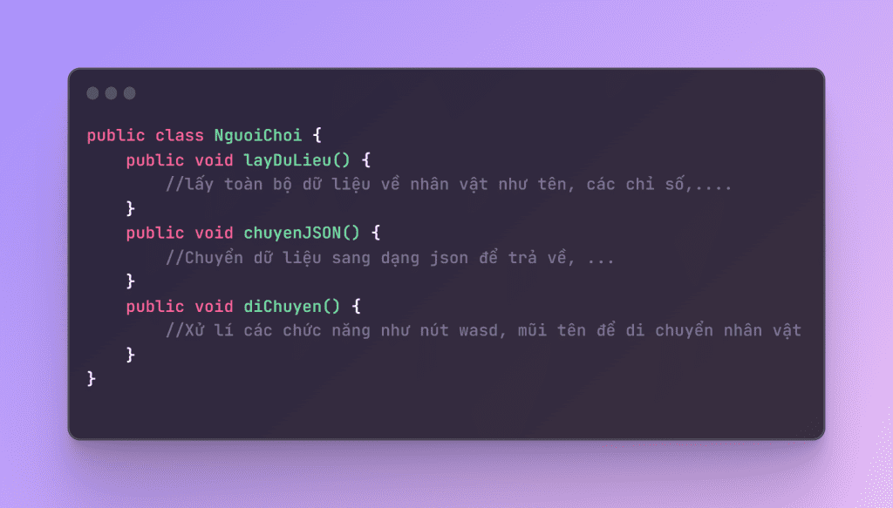

- Việc cho toàn bộ các phương thức gộp vào 1 class NguoiChoi như này đã vi phạm quy tắc, thực hiện rất nhiều thay đổi chỉ trong 1 class như lấy dữ liệu từ database, chuyển sang json để trả về, di chuyển nhân vật, …. `Sau này khi nâng cấp thêm chức năng, class này ngày càng phình to ra.` Khiến cho việc bảo trì, nâng cấp, test, …. trở lên khó khăn hơn sau này.

`Thay vì vậy, ta có thể chuyển thành như sau`

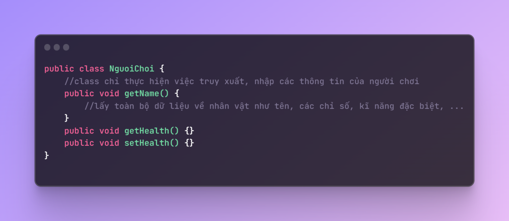

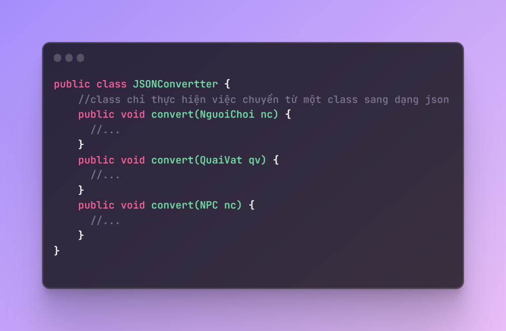

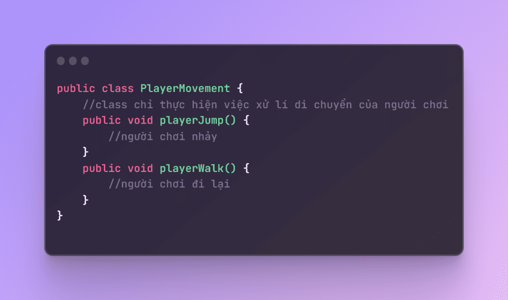

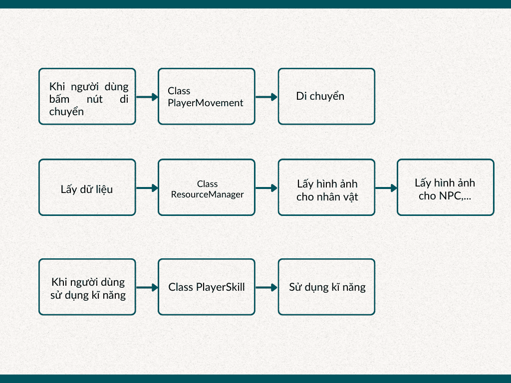

- Lúc này mỗi class sẽ độc lập hơn và các luồng hoạt động cũng sẽ rõ ràng hơn, khi có lỗi xảy ra hay cần nâng cấp chức năng, bạn có thể dễ dàng sửa đổi vào các class trong 1 luồng chứ không phải thay đổi hay thêm mọi thứ vào 1 class và khiến chúng phình to hơn nữa.
  `Tuy số lượng class nhiều hơn những việc sửa chữa sẽ đơn giản hơn, dễ dàng tái sử dụng hơn, class ngắn hơn nên cũng ít bug hơn.`
  Một số ví dụ về nguyên tắc SRP cần xem xét có thể cần được tách riêng bao gồm: `Persistence, Validation, Notification, Error Handling, Logging, Class Instantiation, Formatting, Parsing, Mapping, …`

#### 1.2. Open/Closed Principle: Quy tắc mở đóng

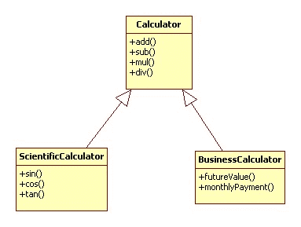

Nguyên tắc này được phát biểu như sau:

- Có thể thoải mái mở rộng 1 class, nhưng không được sửa đổi bên trong class đó.
  `"Objects or entities should be open for extension, but closed for modification."`

- Điều này có nghĩa là một class nên mở rộng được, nhưng không nên sửa đổi bên trong class đó. Điều này giúp cho việc mở rộng chức năng, thêm tính năng mới, mở rộng class, module, … mà không cần phải sửa đổi code cũ, giúp cho việc bảo trì, nâng cấp, test, … dễ dàng hơn.

- Theo nguyên tắc này, sau khi thiết kế một class với một số chức năng nhất định, cần đảm bảo các chức năng này hoạt động trơn tru trong tương lai, tránh sửa đổi thêm sau này. Như vậy, class luôn “đóng – closed” cho các sửa đổi vào các chức năng đã được thiết kế trước, nhưng lại phải “mở – open” để mở rộng tính năng hơn, để mở thì có 1 số cách phổ biến như:
  - Sử dụng kế thừa
  - Sử dụng interface
  - Sử dụng một số design pattern như Strategy, Decorator, …

Ví dụ:

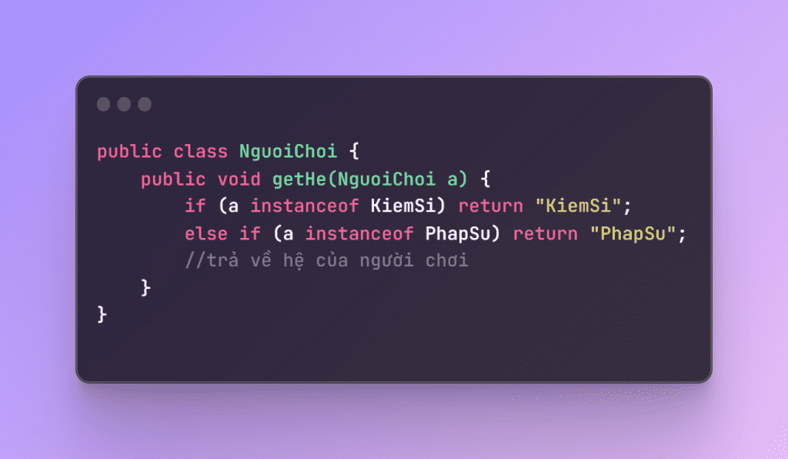

- Với cách thiết kế như trên, khi ta có các class con kế thừa từ class cha NguoiChoi, và cần kiểm tra xem class con có hệ là gì, hay ví dụ ta cần tạo thêm nhiều class con khác tương tự, `ta lại phải thêm nhiều if else vào class gốc`.

- `Thay vào đó, ta có thể thiết kế như sau:`

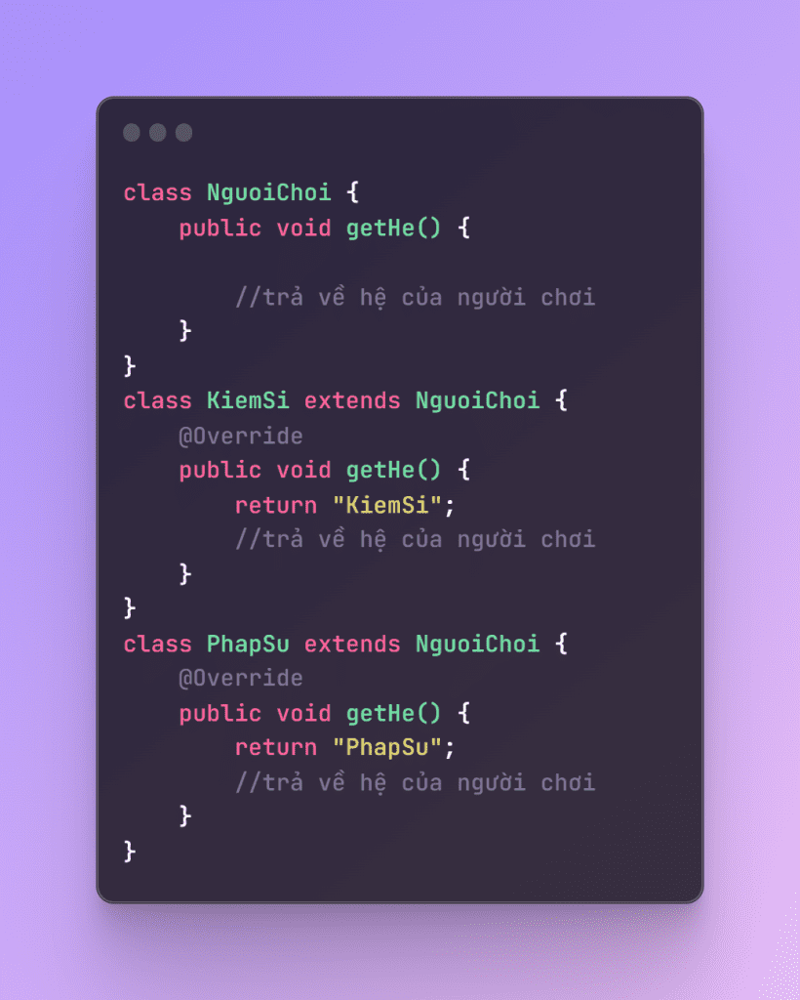

- Lúc này, khi cần nâng cấp thêm nhiều hệ mới cho hệ thống, ta chỉ cần tạo các class con và sử dụng chức năng của class chính, không cần thực hiện trực tiếp vào class chính nữa.

- `Lợi ích` của nguyên lý này là đôi khi chúng ta cần sử dụng các class từ các nguồn thư viện thứ 3, hoặc từ chính các thư viện có sẵn trong Java. `Chúng ta có thể dễ dàng extend và tạo các class con mới kế thừa từ class cha để phục vụ cho một mục đích, chức năng mới của dự án, mà không cần quá lo lắng về class cha sẽ bị lỗi do ta đã không sửa đổi chúng.` -> Chỉ kế thừa và thay đổi những phần cần thiết.

#### 1.3. Liskov Substitution Principle: Quy tắc thay thế Liskov


- Barbara Liskov đã đưa ra nguyên tắc `Liskov Substitution Principle (LSP)` này. Nguyên tắc này cho rằng: trong kế thừa, các class con, `class kế thừa phải luôn có thể thay thế được class cha.` Tức là, nếu `class A kế thừa từ class B, thì mình luôn có thể sử dụng class A thay cho class B mà các chức năng không bị thay đổi.`

Lấy ví dụ về hình vuông và hình chữ nhật

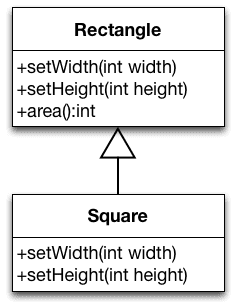
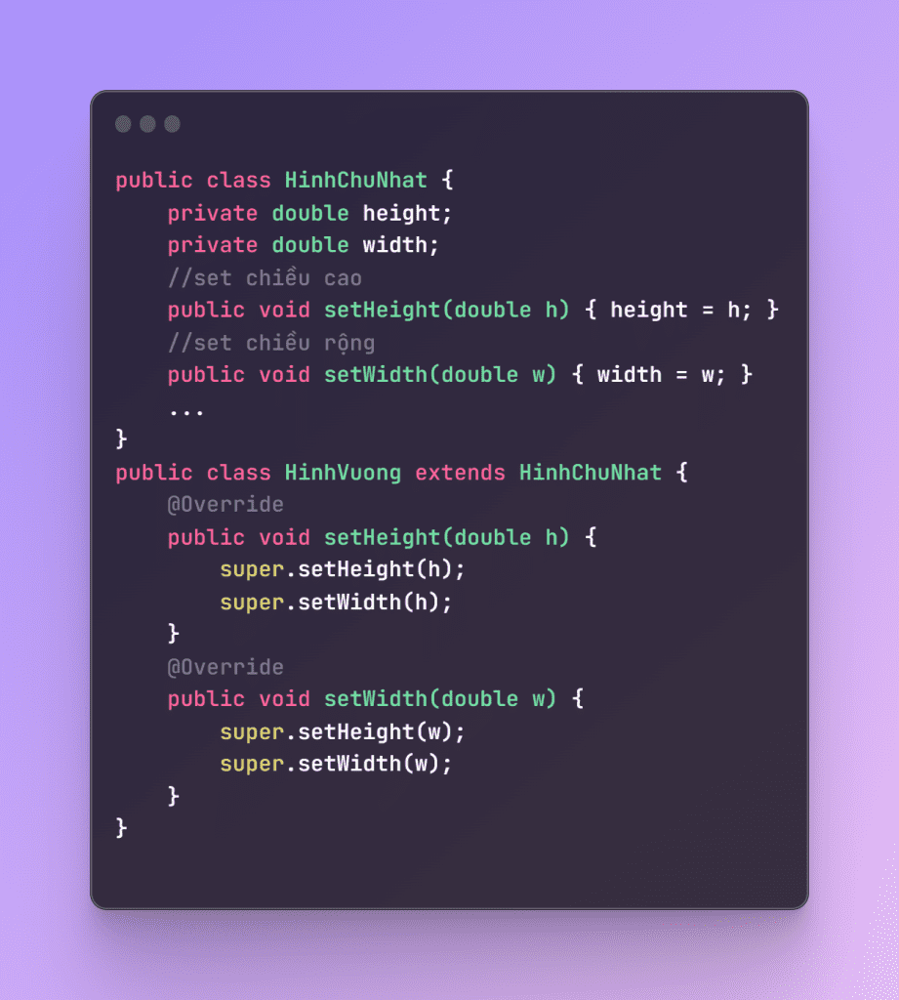

- Như trong toán học được dạy ở các cấp dưới, ta hay được nghe là `“hình vuông cũng là hình chữ nhật”`, `Nhìn ví dụ` trên ta thấy mọi tính toán đều rất hợp lý. Do hình vuông có 2 cạnh bằng nhau, mỗi khi set độ dài 1 cạnh thì ta set luôn độ dài của cạnh còn lại bằng cách viết đè phương thức set chiều cao và set chiều rộng.

- Tuy nhiên, class HinhVuong sau khi kế thừa class HinhChuNhat đã `làm thay đổi các đặc tính vốn có của HinhChuNhat`, dẫn đến `vi phạm LSP`.

##### Những vi phạm về nguyên lý LSP

- Các lớp dẫn xuất có các phương thức ghi đè phương thức của lớp cha nhưng với chức năng hoàn toàn khác.
- Các lớp dẫn xuất có phương thức ghi đè phương thức của lớp cha là một phương thức rỗng.
- Các phương thức bắt buộc kế thừa từ lớp cha ở lớp dẫn xuất nhưng không được sử dụng.
- Phát sinh ngoại lệ trong phương thức của lớp dẫn xuất.

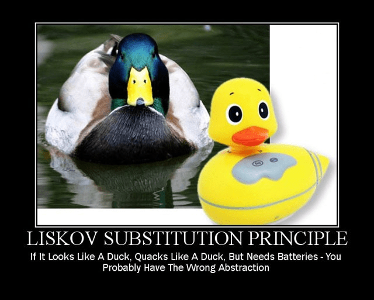

- Câu chuyện về con vịt nhựa: Nếu bạn có một con vịt nhựa, nó là 1 con `vịt`, có thể kêu như vịt, nhưng mà lại cần pin, thì nó không thể thay thế cho con vịt thật được.

- Đây là nguyên lý… `dễ bị vi phạm nhất`, nguyên nhân chủ yếu là do sự thiếu kinh nghiệm khi thiết kế class. Thông thường, design các class dựa theo đời thật: hình vuông là hình chữ nhật, file nào cũng là file. Tuy nhiên, không thể bê nguyên văn mối quan hệ này vào code. Hãy nhớ 1 điều:

- Nguyên lý này ẩn giấu trong hầu hết mọi đoạn code, giúp cho code linh hoạt và ổn định mà ta không hề hay biết. Ví dụ như trong Java, `ta có thể chạy hàm foreach với List, ArrayList, LinkedList bởi vì chúng cùng kế thừa interface Iterable`. Các class List, ArrayList, … đã được thiết kế đúng LSP, chúng có thể thay thế cho Iterable mà không làm hỏng tính đúng đắn của chương trình.

##### Sửa vấn đề hình vuông - hình chữ nhật

- Theo đó, để sửa vấn đề hình vuông – hình chữ nhật trên, ta `có thể` để chúng cùng kế thừa một class Shape như sau

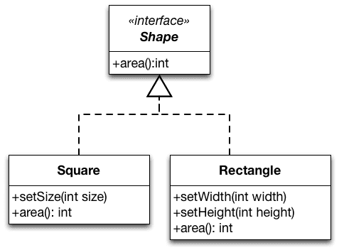

Lúc này việc set các chiều cao và chiều rộng thì chỉ class con mới có, và không vi phạm nguyên tắc LSP.

`Việc thiết kế áp dụng theo nguyên tắc LSP giúp chúng ta giảm bớt quá lạm dụng việc kế thừa trong class. Ý nghĩa của các chức năng không được thay đổi để có thể sử dụng ở nhiều phạm vi khác nhau hơn.`

- Ngoài ra có thể sử dụng Design Pattern như Builder, Factory, ... để giải quyết vấn đề này.

### 2. KISS, DRY, YAGNI

#### 2.1. KISS


- `KISS` là viết tắt của `Keep It Simple, Stupid`. Nguyên tắc này khuyến khích việc thiết kế và viết code đơn giản, dễ hiểu, dễ bảo trì. `KISS` không có nghĩa là viết code ngắn gọn, mà là viết code dễ hiểu, dễ bảo trì, dễ mở rộng.

- Đôi lúc, ta nghĩ quá phức tạp vấn đề, ví dụ dự án nhỏ, nhưng ta lại áp dụng một số công nghệ quá phức tạp, như dùng những thư viện lớn cho chức năng nhỏ, làm dự án nặng hơn. Dùng thuật toán quá cao cho những vấn đề nhỏ, dần dà code trở nên phức tạp, khó bảo trì, khó mở rộng.

#### 2.2. DRY

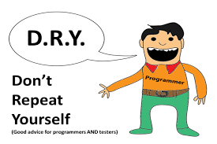

- `DRY` là viết tắt của `Don’t Repeat Yourself`. Nguyên tắc này khuyến khích việc viết code không lặp lại, không viết lại những chức năng đã có sẵn. `DRY` giúp giảm thiểu lỗi, giảm thiểu thời gian viết code, giảm thiểu thời gian bảo trì.

- Khi viết code, nếu có một chức năng nào đó mà ta cần sử dụng nhiều lần, ta nên viết thành một hàm, một class, một module

#### 2.3. YAGNI

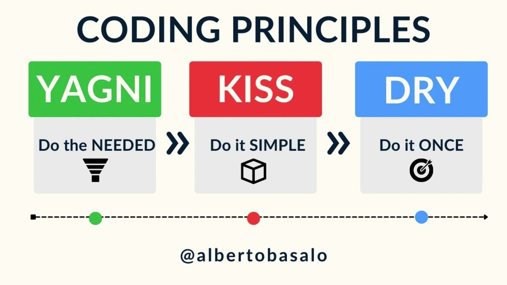

- `YAGNI` là viết tắt của `You Ain’t Gonna Need It`. Nguyên tắc này khuyến khích việc viết code dựa trên những yêu cầu thực tế, không viết những chức năng không cần thiết, không viết những chức năng dựa trên giả định.

- Dự án chỉ cho một trường học sử dụng bởi khoảng 100 cán bộ nhân viên. Ta có cần làm nó có cân bằng tải, có hệ thống database phân tán xịn MongoDB, có hệ thống cache Redis, có hệ thống tìm kiếm Elasticsearch, có hệ thống gửi mail, có hệ thống chat, … không? `YAGNI` khuyến khích việc viết code dựa trên những yêu cầu thực tế, không viết những chức năng không cần thiết, không viết những chức năng dựa trên giả định.

### 3. Luồng đi trong spring boot
[Đọc ở đây](https://viblo.asia/p/luong-di-trong-spring-boot-ORNZqdELK0n "https://viblo.asia/p/luong-di-trong-spring-boot-ORNZqdELK0n")

---

## C. Các bước thực hiện

Từ 3 block B-C-E đơn giản ở pha Phân tích, khi qua pha Thiết kế nó đã trở thành: Component (React) -> Controller -> DTO -> Service -> Entity -> Repository.
Quá trình phân rã này đảm bảo hệ thống tuân thủ chặt chẽ kiến trúc N-Tier (nhiều lớp), tách biệt hoàn toàn việc hiển thị (React), vận chuyển dữ liệu (DTO), đón nhận (Controller), tính toán nghiệp vụ (Service) và lưu trữ (Entity/Repository). Việc tuân thủ nghiêm ngặt các Convention đặt tên giúp mã nguồn trở nên tự giải thích (self-documenting), sạch sẽ và dễ bảo trì.

### BƯỚC 1: PHÂN RÃ LỚP BIÊN (BOUNDARY DECOMPOSITION)
Trong sơ đồ phân tích, Lớp biên (Boundary Class) được định nghĩa là lớp mô hình hóa sự tương tác giữa sản phẩm phần mềm và các tác nhân bên ngoài (actors), tác nhân bên ngoài ở đây không phải chỉ gồm con người mà còn có thể là các hệ thống khác (như FE). Khi thiết kế với stack ReactJS + Spring Boot, 1 lớp Boundary ở pha phân tích sẽ bị "xé" ra làm 3 thành phần vật lý trong pha thiết kế:

**1.1. Frontend Component (ReactJS)**
*   **Bản chất:** Giao diện cho người dùng
*   **Quy tắc đặt tên (Naming Convention):**
    *   **Tên Component/File:** Sử dụng **PascalCase**, phải là Danh từ hoặc Cụm danh từ (Ví dụ: `CommentForm.jsx`).
    *   **Tên Hàm sự kiện:** Sử dụng **camelCase**, bắt đầu bằng tiền tố `handle` (xử lý event) hoặc `on`. 
        *   *Ví dụ:* `handleSubmit`, `onChange`.
    *   **Tên State:** Sử dụng **camelCase**, thể hiện đúng dữ liệu 
        *   *Ví dụ:* `content`.
*   **Thiết kế:** Nó sẽ trở thành một UI Component (ví dụ: `<CommentForm/>`). Component này chứa State để lưu tạm dữ liệu người dùng gõ và một hàm `handleSubmit` để gọi API.

**1.2. Backend Controller (Spring Boot `@RestController`)**
*   **Bản chất:** "Người gác cổng" của Backend.
*   **Quy tắc đặt tên (Naming Convention):**
    *   **Tên Class:** Sử dụng **PascalCase**, là danh từ theo cú pháp `[Tên_Entity]Controller`
        *   *Ví dụ:* `CommentController`
    *   **Tên Đường dẫn (Endpoint):** Sử dụng **kebab-case** và là **Danh từ số nhiều** 
        *   *Ví dụ:* `/api/comments`
    *   **Tên Method:** Sử dụng **camelCase**, bắt đầu bằng một **Động từ**
        *   *Ví dụ:* `addComment()`.
*   **Thiết kế:** Trở thành lớp `CommentController`. Nhiệm vụ của nó chỉ là: Nhận request (JSON) -> Xác thực quyền (Authorization) -> Gọi lớp Control (Service) -> Trả về HTTP Status Code (200 OK, 400 Bad Request). Tuyệt đối không viết logic nghiệp vụ ở đây.

**1.3. Data Transfer Object (DTO)**
*   **Bản chất:** Cấu trúc dữ liệu thuần túy dùng để vận chuyển dữ liệu qua lại giữa Frontend và Backend. **LƯU Ý TUY ĐƯỢC TÁCH RA TỪ BOUNDARY NHƯNG NÓ KHÔNG THUỘC BẤT CỨ LỚP NÀO TRONG BCE**
*   **Quy tắc đặt tên (Naming Convention):**
    *   **Tên Class:** Sử dụng **PascalCase**. Luôn thêm hậu tố `DTO`, `Request`, hoặc `Response` (*Ví dụ:* `CommentRequestDTO` hoặc `CreateCommentRequest`).
    *   **Tên Thuộc tính:** Sử dụng **camelCase**, ánh xạ chính xác với key của chuỗi JSON (*Ví dụ:* `postId`).
*   **Thiết kế:** Theo Clean Code, DTO là cấu trúc dữ liệu phơi bày các biến (thường các biến sẽ là public hoặc có getter/setter) và không chứa bất kỳ hành vi/nghiệp vụ nào.

### BƯỚC 2: PHÂN RÃ LỚP ĐIỀU KHIỂN (CONTROL DECOMPOSITION)
Lớp Điều khiển (Control) trong ACD dùng để mô phỏng các thuật toán và quy tắc nghiệp vụ phức tạp.

**2.1. Backend Service (Spring Boot `@Service`)**
*   **Bản chất:** Trái tim nghiệp vụ của chức năng.
*   **Quy tắc đặt tên (Naming Convention):**
    *   **Tên Class:** Sử dụng **PascalCase**, cú pháp `[Tên_Entity]Service` (*Ví dụ:* `CommentService`). Tránh các từ gây nhiễu vô nghĩa như `Manager`, `Processor`.
    *   **Tên Method:** Sử dụng **camelCase**. Bắt buộc phải là Động từ mang ý nghĩa **nghiệp vụ** 
        *   *Ví dụ:* `createComment()`, `approveComment()` thay vì `insertToDB()`.
*   **Thiết kế:** Trở thành lớp `CommentService`. Nó nhận `CommentRequestDTO` từ Controller, áp dụng các luật (*Ví dụ:* Kiểm tra xem user có bị cấm bình luận không? Bài viết có đang khóa bình luận không?).
*   **Lưu ý Senior:** Lớp Service đóng vai trò là "Nhà điều phối" (Coordinator). Nó không tự làm mọi thứ mà tuân theo nguyên tắc Thiết kế hướng trách nhiệm: nó gọi Entity ra và "ra lệnh" cho Entity thực hiện các thay đổi trạng thái.

### BƯỚC 3: PHÂN RÃ LỚP THỰC THỂ (ENTITY DECOMPOSITION)
Lớp Thực thể (Entity) lưu trữ thông tin sống thọ (long-lived hay cần lưu trữ lâu dài) của hệ thống. 1 lớp Entity trong phân tích sẽ được tách thành 2 thành phần trong thiết kế Spring Boot:

**3.1. Database Entity (Spring Boot `@Entity`)**
*   **Bản chất:** Đối tượng nghiệp vụ có cấu trúc dữ liệu tương ứng với bảng trong Database.
*   **Quy tắc đặt tên (Naming Convention):**
    *   **Tên Class:** Sử dụng **PascalCase**. Bắt buộc là **Danh từ số ít** (*Ví dụ:* `Comment`, `BlogPost`). Tránh mọi tiền tố mã hóa như `tbl_Comment`.
    *   **Tên Thuộc tính:** Sử dụng **camelCase**, bộc lộ rõ ý định 
        *   *Ví dụ:* `content`, `createdAt` thay vì `cmt`, `crtDt`.
    *   **Tên Method:** Sử dụng **camelCase**. Là các động từ thể hiện thay đổi trạng thái 
        *   *Ví dụ:* `initializeComment()`.
*   **Thiết kế:** Đây phải là một Object thực thụ: Che giấu dữ liệu (Private fields) và bộc lộ hành vi (Public methods). Khai báo rõ kiểu dữ liệu, các thuộc tính ràng buộc, và quan trọng nhất là Navigability (Hướng điều hướng) với các Entity khác (*ví dụ:* `BlogPost` và `User`).

**3.2. Data Access / Repository (Spring Boot `@Repository`)**
*   **Bản chất:** Cầu nối trung gian để giao tiếp với Cơ sở dữ liệu.
*   **Quy tắc đặt tên (Naming Convention):**
    *   **Tên Interface:** Sử dụng **PascalCase**, cú pháp `[Tên_Entity]Repository` (*Ví dụ:* `CommentRepository`).
    *   **Tên Method:** Sử dụng **camelCase**, tuân thủ cú pháp query creation của Spring Data JPA (*Ví dụ:* `findByPostId()`).
*   **Thiết kế:** Trở thành `CommentRepository` (thường kế thừa `JpaRepository`). Nó cung cấp các hàm lưu, xóa, sửa và tìm kiếm mà không cần viết câu lệnh SQL thủ công.

